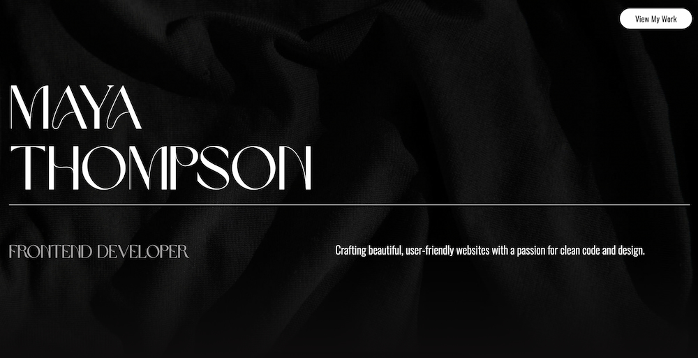

# Portfolio - Maya Thompson



Welcome to my online portfolio! I am a **Frontend Developer** with a passion for crafting beautiful, user-friendly websites using HTML, CSS, and JavaScript. This portfolio showcases a few of my projects that demonstrate my skills in web development.

## Table of Contents

1. [Projects](#projects)
2. [Technologies Used](#technologies-used)
3. [How to Run](#how-to-run)
4. [Contact](#contact)
5. [Acknowledgments](#acknowledgments)

## Projects

Here are a few of the projects I've worked on:

### 1. **Rainy Days**

An e-commerce site for the _Rainy Days_ brand, built using HTML, CSS, and JavaScript. This project features:

- Product browsing
- Cart management
- Responsive design for all screen sizes

[View Project](https://mayamariaruth.github.io/html-css-course-assignment/index.html) | [GitHub Repo](https://github.com/Mayamariaruth/html-css-course-assignment)

### 2. **Oslo Science Museum**

A playful and responsive website for the _Oslo Science Museum_. Built with HTML, CSS, and JavaScript, this site is designed to engage both children and parents. Features include:

- Interactive layout
- Responsive design
- Modern UI elements

[View Project](https://mayamariaruth.github.io/science-museum/) | [GitHub Repo](https://github.com/Mayamariaruth/science-museum)

### 3. **HotView Labs Blog**

A blog platform for _HotView Labs_, featuring sorting, pagination, and dynamic post management. This project demonstrates my ability to build functional websites with the following:

- Custom sorting and pagination
- Dynamic content loading using the Noroff API
- Responsive layout

#### API Usage:

This project integrates the [Noroff API v2](https://docs.noroff.dev/docs/v2) to dynamically fetch blog posts, display them with sorting and pagination features, and allow for CRUD operations on blog content.

[View Project](https://hotviewlabs1.netlify.app/) | [GitHub Repo](https://github.com/NoroffFEU/FED1-PE1-Mayamariaruth)

## Technologies Used

- **HTML5**
- **CSS3**
- **JavaScript**
- **GitHub** (for version control)
- **Netlify** (for hosting)

## How to Run

To view this portfolio locally, you can clone the repository:

```bash
git clone https://github.com/Mayamariaruth/POR1.git
```

## Contact

You can connect with me through my [LinkedIn Profile](https://www.linkedin.com/in/maya-thompson-9b602a255/).

## Acknowledgments

- https://stackoverflow.com/
- https://www.w3schools.com/
- https://www.geeksforgeeks.org/
- https://www.youtube.com/
- https://sudobird.com/blog/tech/simple-carousel-using-javascript-scrolling
- https://1stwebdesigner.com/create-a-carousel-using-css-scroll-snap-and-javascript/
- https://stackoverflow.com/questions/69476576/how-to-combine-intersection-observer-with-parallax
