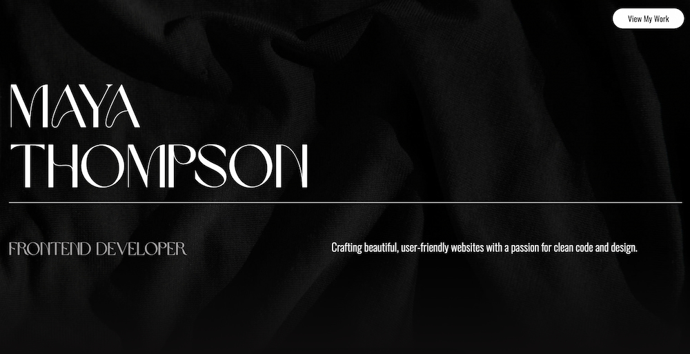

# Portfolio - Maya Thompson



Welcome to my online portfolio! I am a **Frontend Developer** with a passion for crafting beautiful, user-friendly websites using HTML, CSS, and JavaScript. This portfolio showcases a few of my projects that demonstrate my skills in web development.

## Table of Contents

1. [Projects](#projects)
2. [Technologies Used](#technologies-used)
3. [How to Run](#how-to-run)
4. [Contact](#contact)
5. [Acknowledgments](#acknowledgments)

## Projects

Here are a few of the projects I've worked on:

### 1. **Auction House**

A front-end auction platform built with HTML5, CSS3, and vanilla JavaScript, integrating the Noroff API for dynamic data and user interaction. The project focuses on authentication, structured application logic, and real-time content updates without using a framework.

#### Features

- Browse and view active auction listings
- View detailed item pages
- Place bids on items
- User registration and login
- Responsive layout across devices

[View Project](https://mayamariaruth.github.io/auctionhouse/) | [GitHub Repo](https://github.com/Mayamariaruth/auctionhouse)

### 2. **Shopella**

A simple e-commerce web application built with React, TypeScript, React Router, and Zustand for state management. It allows users to browse products, view details, add items to a shopping cart, adjust quantities, submit a contact form, and complete a mock checkout flow.

#### Features

- Browse products
- View individual product details
- Add and remove items from cart
- Cart total calculation
- Responsive and accessible design

[View Project](https://shopellastore.netlify.app/) | [GitHub Repo](https://github.com/NoroffFEU/jsfw-2025-v1-javascript-frameworks-ca)

### 3. **Chattr.**

A responsive social posting app interface built with Bootstrap and custom SCSS overrides. It showcases UI features such as creating new posts, viewing posts, and smooth interaction, with modern styling and accessibility considerations.
**Note:** This is a fully static front-end demo without backend functionality.

#### Features

- Fetch and display posts
- Create new posts
- Edit existing posts
- Delete posts
- Responsive layout

[View Project](https://mayamariaruth.github.io/css-repo-cs/) | [GitHub Repo](https://github.com/Mayamariaruth/css-repo-cs)

#### API Usage:

This project integrates the [Noroff API v2](https://docs.noroff.dev/docs/v2) to dynamically fetch data, and allow for CRUD operations.

## Portfolio tech stack

- **HTML5**
- **CSS3**
- **JavaScript**
- **Git & GitHub** (for version control)
- **GitHub Pages** (for hosting)

## How to Run

To view this portfolio locally, you can clone the repository:

```bash
git clone https://github.com/Mayamariaruth/POR1.git
```

## Contact

You can connect with me through my [LinkedIn Profile](https://www.linkedin.com/in/maya-thompson-9b602a255/).

## Acknowledgments

- https://stackoverflow.com/
- https://www.w3schools.com/
- https://www.geeksforgeeks.org/
- https://www.youtube.com/
- https://sudobird.com/blog/tech/simple-carousel-using-javascript-scrolling
- https://1stwebdesigner.com/create-a-carousel-using-css-scroll-snap-and-javascript/
- https://stackoverflow.com/questions/69476576/how-to-combine-intersection-observer-with-parallax
